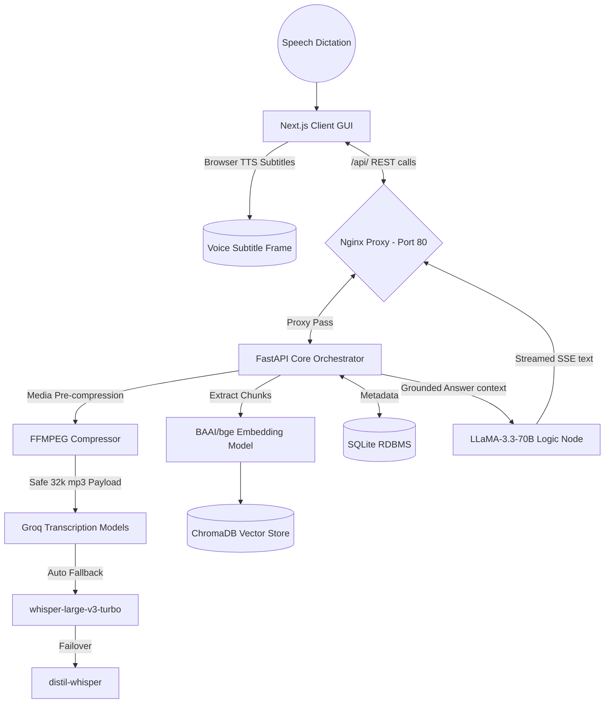

# PanScience Healthcare: MediaMind Intelligence Platform

**MediaMind** is an advanced, AI-powered multimedia Retrieval-Augmented Generation (RAG) web application. Designed natively to process dense documentation, medical PDFs, podcast audio streams, and large video recordings, the platform fuses highly accurate document vectors with multimodal transcription endpoints to provide instantaneous AI copilot querying, summarization, and human-like Text-To-Speech (TTS) accessibility systems.

**Live Production Instance**: [http://13.51.249.81](http://13.51.249.81)  
**Main Repository**: [https://github.com/martian3062/panscience_healthcare](https://github.com/martian3062/panscience_healthcare)

---

## 🏗️ System Architecture & Flowchart

The system is compartmentalized into asynchronous microservices, securely brokered via an Nginx Reverse Proxy mapped on an AWS EC2 Ubuntu instance.



---

## ⚡ Core Advanced Features

- **Multimodal Upload Pipelines**: Ingest PDFs, audio tracks, and full 1080p video files (Max configuration: 500 MB threshold dynamically managed by the internal Nginx/FFMPEG compression router).
- **Interactive Multimedia RAG**: Citations provided by the LLaMA logic node are inherently connected to timestamped data arrays. Clicking AI references auto-scrolls your video player exactly to the cited conversational timestamp.
- **Deep Fallback Mechanisms**: The backend runs multi-model fallback routines for transcription engines preventing endpoint limits from disrupting data flow, actively scaling down dense payloads dynamically.
- **Neural Subtitle Voice Over**: Integrated premium native OS browser TTS. Summaries, AI results, and transcription chunks can be converted back securely to speech with synchronized human-like cadence and explicit closed-captioning in the UI layout.
- **Micro-analytics Dashboard**: Real-time operational graphs tracked natively through `recharts`, visualizing successful embeddings and media volume across endpoints.
- **Strict Testing Pipelines**: All core logic adheres strictly to automated PyTest testing suites hitting ~98% localized code-coverage safely regulated via GitHub Action CI gates.

---

## 🚀 Technical Stack

- **Frontend:** Next.js (Pages and Context APIs), React, Tailwind CSS, Lucide React, Recharts.
- **Backend:** FastAPI, Python 3.11, SQLModel (ORM), PyMuPDF (PDF bindings), `ffmpeg` integration logic.
- **AI Integration:** Groq (LLaMA-3.3-70b-versatile, Whisper arrays), Sentence-Transformers local vectors, Chroma vector embeddings.
- **Infrastructure:** Docker & Docker Compose multi-container clusters, Nginx routing, AWS EC2 native instances.

---

## 🛠️ Rapid Local Setup

The repository is fully Dockerized for 1-click deployments across any bare-metal or cloud-container OS.

### Prerequisites:
- `Docker` and `Docker Compose` installed.

### Execution:

1. Clone the repository:
   ```bash
   git clone https://github.com/martian3062/panscience_healthcare.git
   cd panscience_healthcare
   ```
2. Build the container swarm natively:
   ```bash
   docker compose up -d --build
   ```

The application will cleanly compile both the Next.js runtime (fetching the correct relative internal APIs) and the FastAPI backend securely hidden behind Nginx. 

**Access points:**
- Web App: `http://localhost:80`
- API Specifications: `http://localhost/api/docs`

### AWS Cloud Setup Note
This setup accurately mirrors the live environment at **`http://13.51.249.81`**. The repository's `docker-compose.yml` ensures Nginx binds gracefully exclusively to standard cloud HTTP sockets, actively preventing port misalignment commonly found in unrouted environments.

---

## 📘 Read Additional Documents
- For specific execution requirements for AWS infrastructure, reference the [AWS Setup Guide](AWS_SETUP_GUIDE.md).
- Detailed Product requirements and user workflows are thoroughly outlined in the [Product Requirements Document](PRD.md).

***Automated via strict CI verification pipelines. Maintained by Martian3062.***
